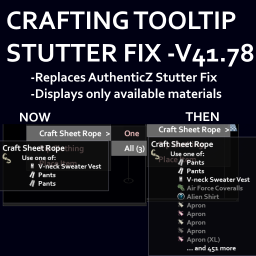

## Fix Crafting Context Menu Stutter
### Vanilla code optimization / bugfix for  Project Zomboid Build 41.78.16
#### Effects:
Removes a lot of unnecessary sorts and inserts to only display available items in the crafting UI tooltip, rather than cycling through the recipe library a few times to tell you what materials you don't have and potentially causing your game to stutter in the process.

The weak point in the original code is exposed pretty clearly as the number of items available for a single recipe, such as "Craft Sheet Rope" as the number of unique clothing items in the game rises. It was never an efficient operation, and the logic of displaying all of the materials you don't have, on an action that's only available when you have the materials on-hand in the first place, seems a bit backwards.

May this fix make your fear of adding multiple ways to craft a single recipe in your mod, or running AuthenticZ for example. a thing of the past. :D

